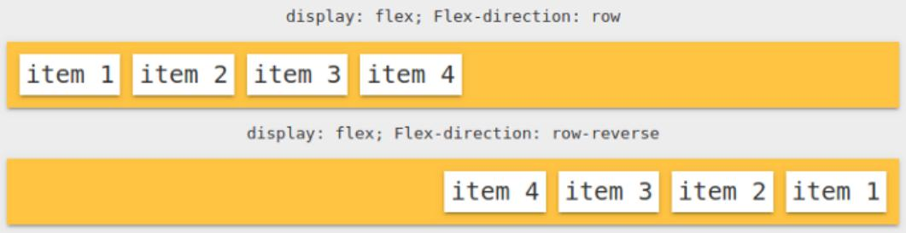
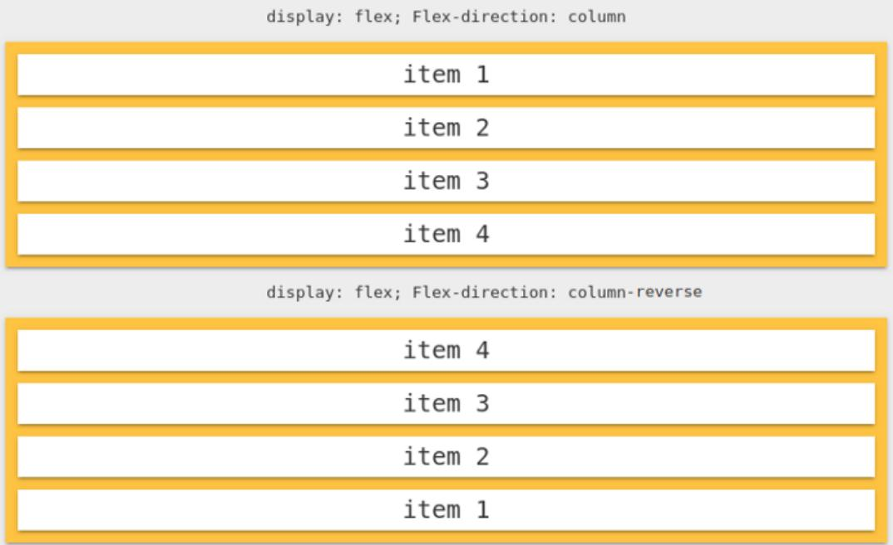
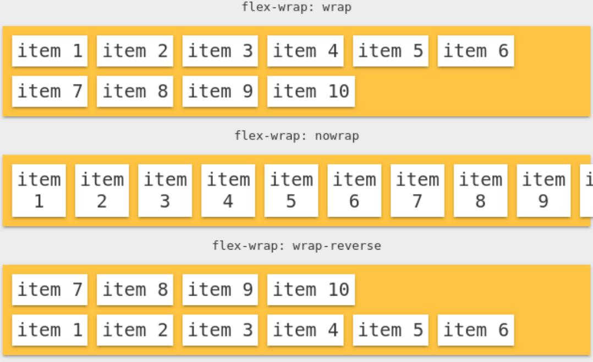
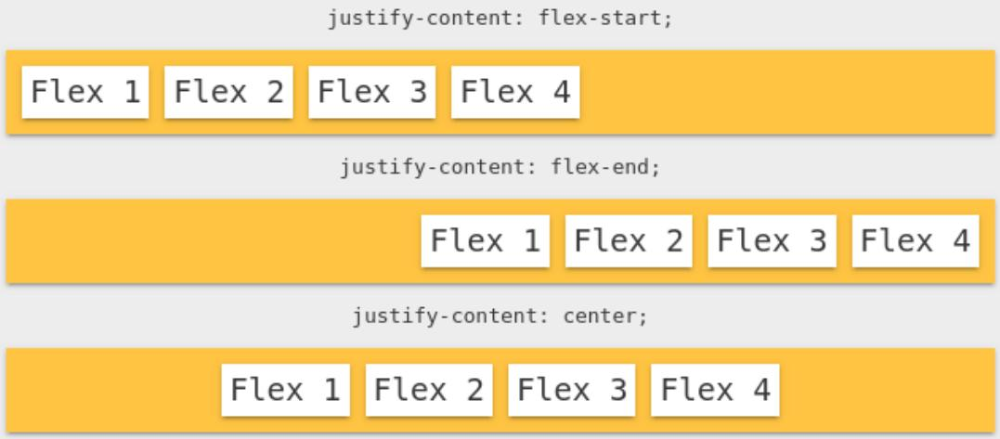
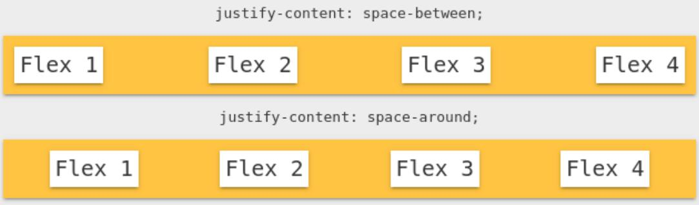
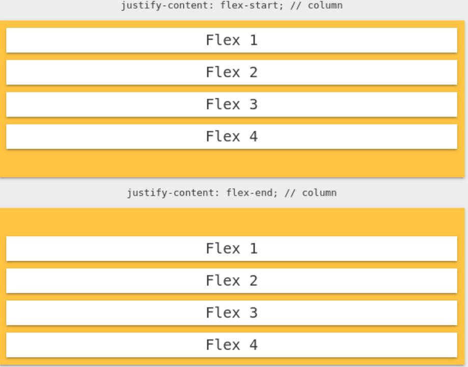
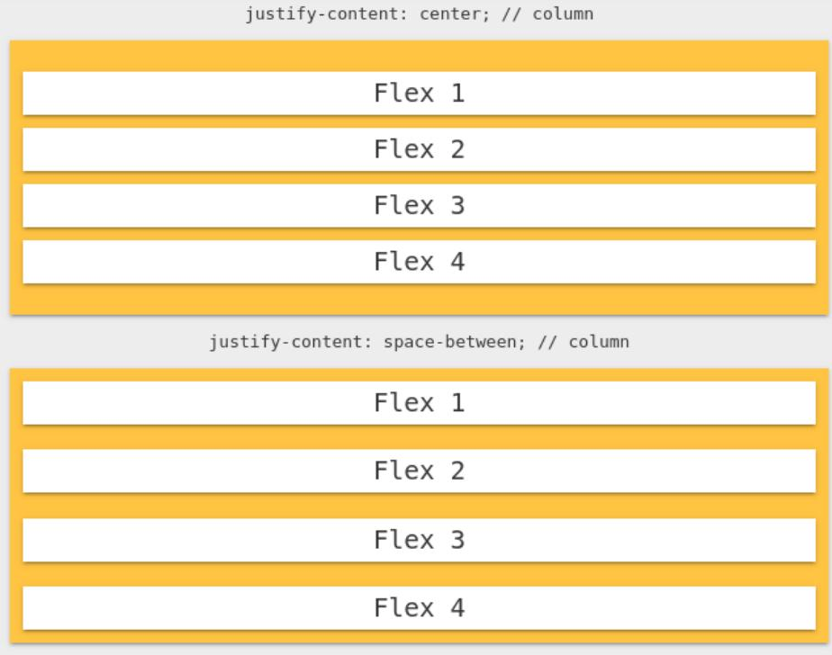
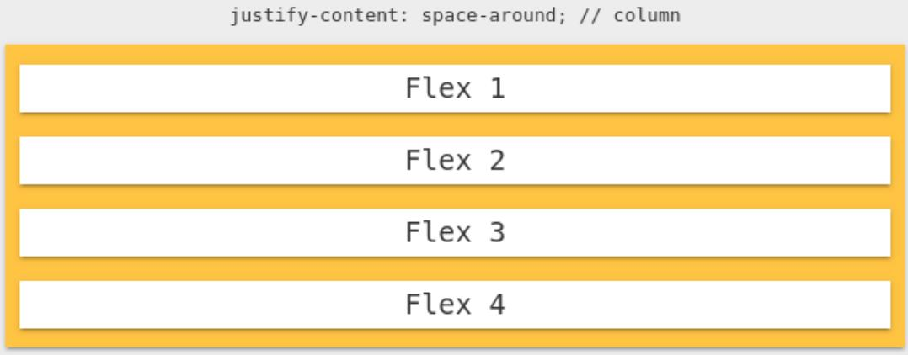

# Curso Full Stack Javascript

###### Professor: [Thiago](https://www.thiago-medeiros.com/formacao-fullstack-javascript/) Medeiros

- Sites:
  - [To Do List](https://gugamacedo.github.io/full-stack-js/aulas/to-do-list/)
  - [Barber Shop](https://gugamacedo.github.io/full-stack-js/aulas/barber-shop/)

- Aulas:
  - [Exercícios JS Avançado](https://gugamacedo.github.io/full-stack-js/aulas/javascript-avancado/exercs.html)
  - [Javascript Avançado](https://gugamacedo.github.io/full-stack-js/aulas/javascript-avancado/)
  - [Exercícios JS Intermediário](https://gugamacedo.github.io/full-stack-js/aulas/javascript-intermediario/exercs.html)
  - [Javascript Intermediário](https://gugamacedo.github.io/full-stack-js/aulas/javascript-intermediario/)
  - [Exercícios JS Básico](https://gugamacedo.github.io/full-stack-js/aulas/javascript-basico/exercs.html)
  - [Javascript Básico](https://gugamacedo.github.io/full-stack-js/aulas/javascript-basico/)
  - [Sass](https://gugamacedo.github.io/full-stack-js/aulas/sass/)
  - [CSS Flexbox](https://gugamacedo.github.io/full-stack-js/aulas/css-flexbox/)
  - [CSS Intermediario 2](https://gugamacedo.github.io/full-stack-js/aulas/css-intermediario-2/)
  - [CSS Intermediario 1](https://gugamacedo.github.io/full-stack-js/aulas/css-intermediario-1/)
  - [Workshop](https://gugamacedo.github.io/full-stack-js/aulas/workshop/)
  - [Menu Horizontal](https://gugamacedo.github.io/full-stack-js/aulas/menu/)

<details><summary><strong>Anotações</strong></summary>
</br>
  <details><summary><strong>JS</strong></summary>

  - `document.querySelector('ELEMENTO/ID/CLASS')` para elementos individuais
  - `document.querySelectorAll('ELEMENTO/ID/CLASS')` para elementos múltiplos
    - Usar o `foreach` quando for iterar
  - Pra capturar eventos `addEventListener('click', () => { COMANDOS })`
    - Outros eventos comuns: `mousemove`, `mouseout`, `mouseenter`, `mouseleave`
  - Para alterar uma classe `ELEMENTO.classList.contains('CLASS') ? ELEMENTO.classList.remove('CLASS') : ELEMENTO.classList.add('CLASS')`
  - Usar `$` nas variáveis que "puxam" HTML
  - Sempre que possível colocar `const` ao invés de `let`
  - Checar o *false* primeiro no condicional
  - Funcionamento de um **foreach**: 
  ```
  ELEMENTOS.forEach((e, index) =>
    e.innerHTML = `Número ${index+1}`
  )
  ```
  </details>

  <details><summary><strong>SASS</strong></summary>

  </details>

  <details><summary><strong>CSS</strong></summary>

- Parentescos:
  - **`>`** diz que a regra tem que ser aplicada somente aos filhos da classe
  - **`+`** aplica a regra pro primeiro irmão direto
  - **`~`** aplica a regra pra todos irmãos diretos
- Quando usar o `display: inline-block;`? quando precisa que fique na mesma (igual o inline) mas precisa acessar as propriedades height e width
- `position: absolute;` é relativo ao body, se quiser que ele seja relativo ao pai, tem que colocar `position: relative;` no pai dele
- `:root` é normalmente usado para se guardar variáveis
- Variáveis são declaradas assim `--variavel-etc: #fff;` e usadas assim `color: var(--variavel-etc);`
  - Alguns padrões: `--color/background/font-primary` `--color/background/font-secondary`
- `*` aplicador universal, aplica as propriedades em tudo que conseguir
  - Alguns padrões: `box-sizing: border-box;`, `margin: 0;`, `padding: 0;`, `font-family: sans-serif;`
- `box-sizing: border-box;` significa que todas box não vão extrapolar o box-model 
- Para importar um arquivo, fonte, etc `@import url('inserir aqui');`
- [CSS Gradient](https://cssgradient.io/)
- Efeitos de "sumir":
  - `display: none;` faz o elemento desaparecer e desocupa o espaço dele
  - `visibility: hidden;` faz o elemento desaparecer e mantêm o espaço dele
  - `opacity: 0;` faz o elemento ficar transparente e mantêm o espaço dele
- Aquele **menu hambúrguer** é "empurrado" atráves do **position** ou **margin**. Não se usa muito `display: block` porque esse não permite efeito de transition, fica "seco"
  - Também se usa `overflow-x: hidden;` pra esconder esse menu que está "empurrado"
- `transition: all 300ms ease;` `transition: background-color 300ms ease;`
- Criar animação exemplo:
```
@keyframes animação {
  0% {
    transform: rotateX(0deg);
  }
  100% {
    transform: rotateX(-90deg);
  }
}
```
- Usar a animação `animation: animação 300ms ease` 
- Pra adicionar conteúdo em um elemento através do css `content: '';`
- Responsividade exemplo
```
@media (max-width: 550px) {
  .gallery.active div {
    width: 90%;
  }
  .seasons button {
    margin: 5px 10px;
  }
  ```
}
- O Flex é aplicado na box pai 
- [Flexbox Froggy](https://flexboxfroggy.com/)
- [Flexbox Defense](http://www.flexboxdefense.com/)
- `align-items:` alinha na vertical. Só funciona com o `flex-direction: row;` que é o padrão do direction
- Quando o flex direction é `column`, o _justify-content_ muda para a vertical e o _align-items_ para a horizontal
- Para alinhar um elemento individual em uma ordem específica na horizontal, use a propriedade `order`. Por padrão começa em zero e também aceita negativo
  - Na vertical use o `align-self`, lembrando da regra do _flex-direction_
- `align-content:` alinha quando você tem o wrap, lembrando da regra do _flex-direction_
- Flex Direction  
- Flex Wrap 
- Justify Content     

  </details>

</details>
